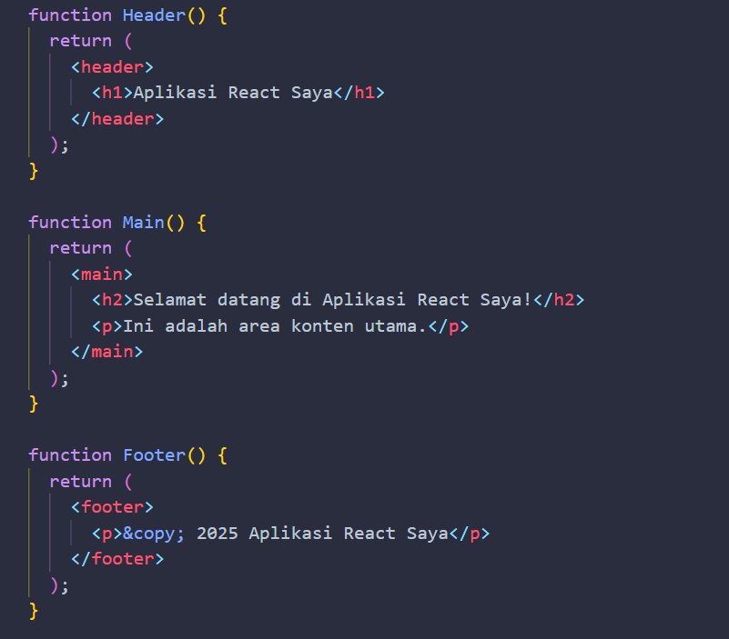
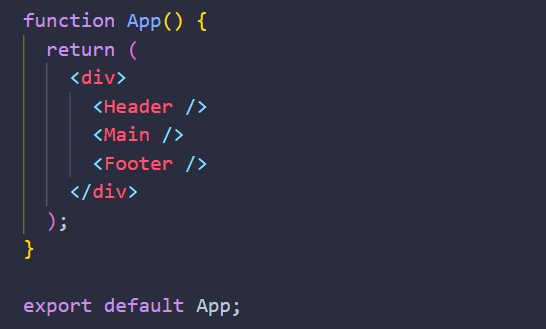
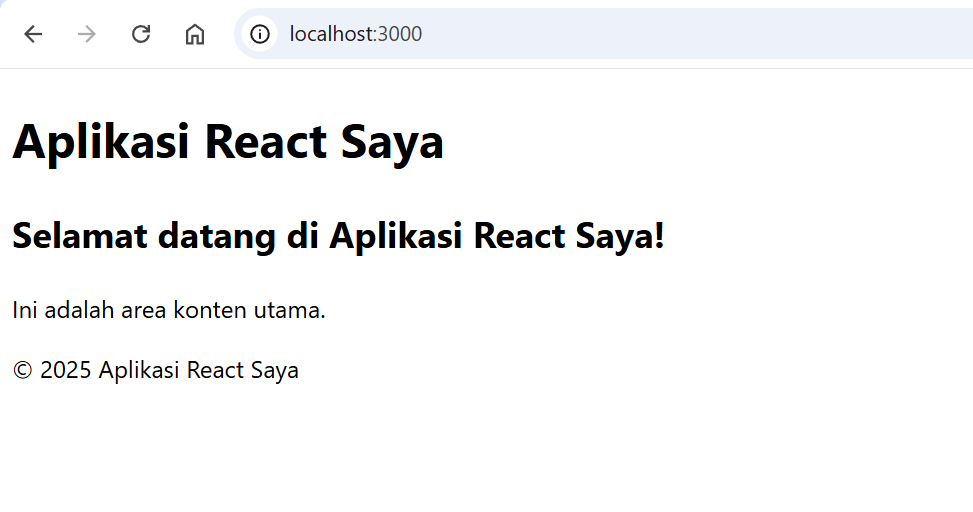
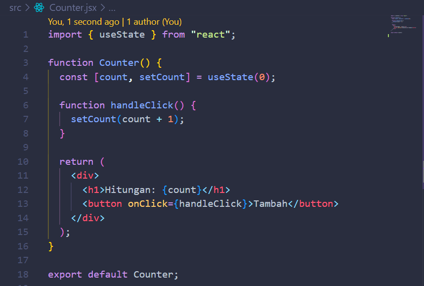
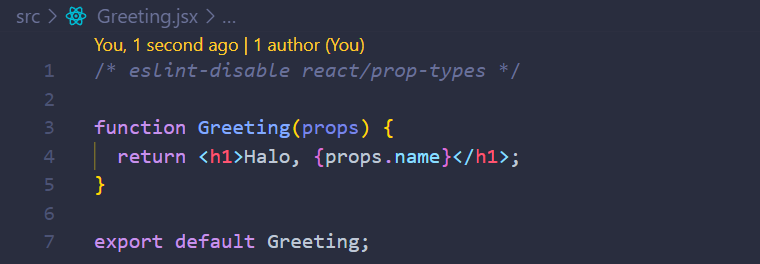
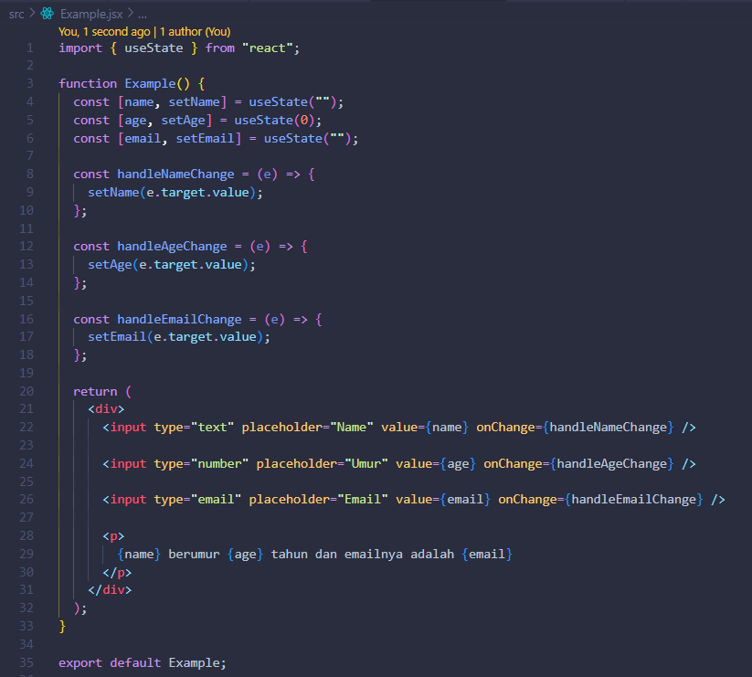
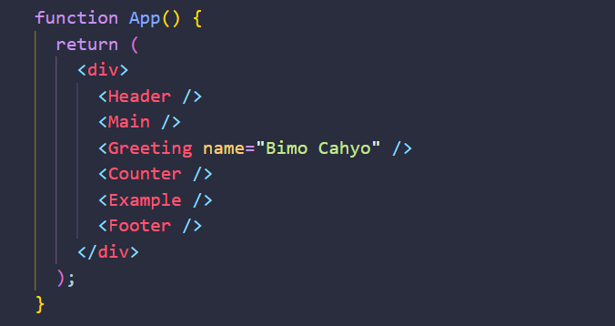
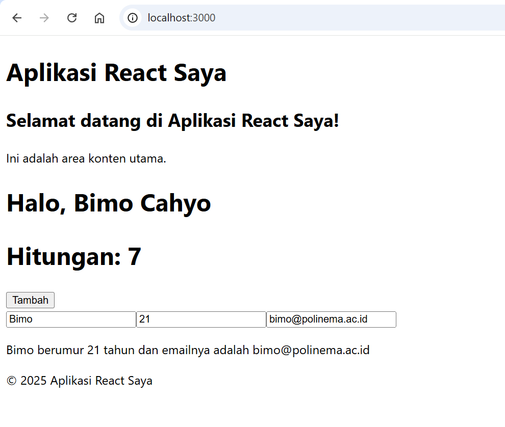

# Laporan Praktikum

|       | Pemrograman Berbasis Framework 2025 |
| ----- | ----------------------------------- |
| NIM   | 244107027010                        |
| Nama  | Bimo Cahyo Kusumo                   |
| Kelas | TI - 4K                             |

## Langkah Praktikum

1. Membuat komponen pada `Header`, `Main`, dan `Footer` dengan cara menuliskan kode berikut pada file **App.jsx**

    

2. Panggil kode sebelumnya pada komponen `App`

    

3. Tampilan website pada browser

    

4. Membuat komponen baru dengan nama `Counter` pada folder src

    

5. Buat juga komponen baru dengan nama `Greeting`

    

6. Tambahkan juga komponen `Example` dengan kode seperti berikut

    

7. Panggil komponen sebelumnya yakni `Counter`, `Greeting`, dan `Example` pada komponen utama `App`

    

8. Tampilan website saat ini

    
